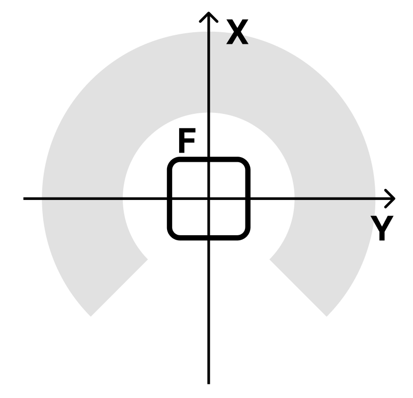

# dobot-hell-2026

полезные заметки которые не стоит забывать

## logs
```
[time] [dobot] сообщение
```
приписки:

\[OS\] - датчик препятсвия (костыльный ИК)

\[CS\] - датчик цвета

\[CV\] - конвеер

## координирование

координирование добота:



для добота на рельсе справедливо использовать значение `L` вместо `Y` если нету вопроса в доступности позиций, близких к рельсу

